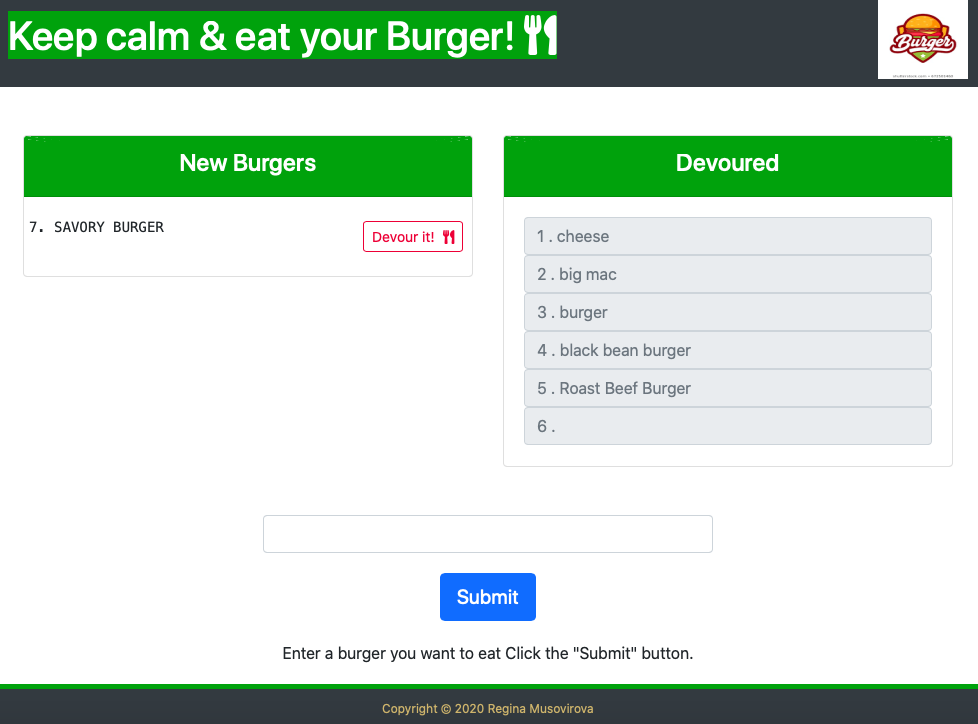

# Burger app 

https://fast-everglades-77602.herokuapp.com

## Description

A burger logger with MySQL, Node, Express, Handlebars and a homemade ORM.
A restaurant app that lets users input the names of burgers they'd like to eat.



        
## Table of Contents
            
* [Installation](#Installation)
* [Usage](#Usage) 
* [Functionality](#Functionality) 
* [License](#License) 
* [Test](#Test)
            
        
## Installation
            
**Step 1 - Clone my repo using the command line below.**
```
git clone 
```
**Step 2 - Change directory to the cloned repo folder.**
```
cd Burger
```
**Step 3 - Install all required NPM packages.**
```
npm install express express-handlebars mysql 
```
**Step 4 - Start the application server using the command line below**
```
node server.js

```

## Functionality

Using an home-grown ORM the app has 3 basic CRUD functions:

1.  READ all entries from the MySQL database and display them to the    DOM using Handlebars.
2. UPDATE a selected burger by clicking "Devour It", which...
    * hits an `/burgers/:id` route in Express to change its "devoured" status in the MySQL database
    * re-routes the webpage back to the index, where the burger is now in the devoured column (via Handlebars)
3. CREATE a new burger using the "Place Order" form, which...
    * hits a `/burgers/create` route in Express to insert a new burger into the MySQL database
    * re-routes the webpage back to the index, where the burger is now ready to be eaten column (via Handlebars)
            
## Usage
            
node server.js
 
## License
            
MIT
        
## Test

none
            
## Questions
            
[](https://www.github.com/Antidetka) | 
[](mailto:musovirova@yahoo.com)
